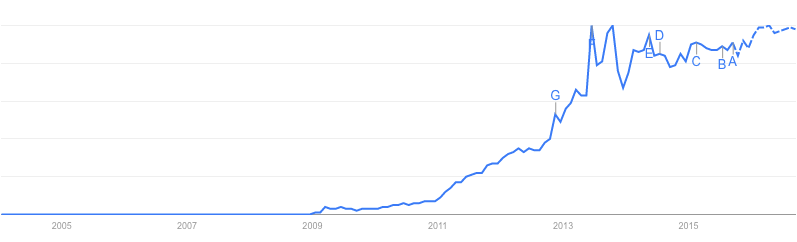
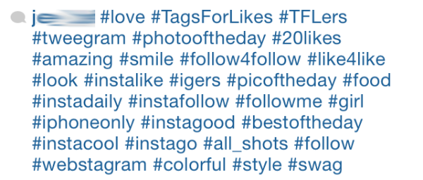

# Week 1

### Today, Thursday 1st October 2015

1. [Welcome](#welcome) :)
* [APIs](#apis) 
* Workshop: [Hash Tags](#workshop) 
* Team project: [Filter Bubbles](#team-project)

### Your [homework](#homework) and [blog](#blog)!

# Welcome

1. [What is this course about?](../../README.md)
* [What's the plan?](../../README.md#plan) Make sure you subscribe to the [calendar feed](https://www.google.com/calendar/ical/rave.ac.uk_obrkgb9c76vv9dj1soaehmav74%40group.calendar.google.com/public/basic.ics)! 
* [What can you learn?](../../README.md#learning-goals)
* Keeping a **journal** to record your creative process is *extremely* important. Don't let your ideas and thoughts fade away! Think of your project blog as your **digital sketchbook**. More on that [here](https://github.com/RavensbourneWebMedia/Blogging#why-blogging).
* **Peer learning**: [one of the most effective ways](http://visible-learning.org/hattie-ranking-influences-effect-sizes-learning-achievement/hattie-ranking-teaching-effects/) to learn something is to teach it to someone else. During this course you'll be sharing your skills and knowledge in class, leading mini-tutorials and moderating debates. Starting with [your homework for next week](#peer-learning-research)! 
* [Rules of the road](../../README.md#rules-of-the-road).

# APIs

### What are **protocols**?

<!--- [ ] Talk about **protocols** (ties in with rules of the road above, btw)?-->

* Rules
* Conventions, system of
* Proper / improper behaviour
* Social protocols
* Technical protocols (HTTP, TCP/IP, DNS)
* Centralised vs decentralised: power and control
* APIs as protocols..

<!-- https://github.com/lmccart/itp-critical-apis/blob/master/discussion/08%20Galloway%20Protocol-OCR.pdf -->

### So what's an **API** then? 

[Disambiguation](https://en.wikipedia.org/wiki/API_(disambiguation)) from Wikipedia.

**A**pplication **P**rogramming **I**nterface.

Something to do with programming applications... an interface for programming applications?! 

### What is an **interface**?

Something that stands **between** you and your goals. 

We're mostly familiar with *graphical user interfaces*, aka *GUI*, such as the icon buttons you click to launch an app, send an email or even start the washing machine.

Gas cookers have interfaces too: you don't operate the flame directly. The interface you use, the thing between you and the flame, are the *knobs* you push and turn.

### An interface to program applications?

> In computer programming, an application programming interface (API) is a set of routines, **protocols**, and tools for building software applications. An API expresses a software component in terms of its operations, *inputs*, *outputs*, and underlying types. [...] A good API makes it easier to develop a program by providing all the building blocks. A programmer then puts the blocks together.

> From [Wikipedia](https://en.wikipedia.org/wiki/Application_programming_interface)

An API **exposes** parts of a system and **determines** how we (programmers) can interact with them to accomplish our (programming) goals. 

Not all parts of a system are exposed, ie *programmable*. 

### The parts of a system which are *programmable* have an API 

An API tells us *which* parts of a system are exposed, and *how* we are allowed to tinker with them. 

A **programming language** can be understood as an API, in the sense that it's the tool between us and programming a computer. 

### JavaScript is our API to a Web browser 

If you want to display the square root of a number on a Web page, the browser can do the calculation for you, provided you ask nicely (ie, it allows you access to its computing functions, using the `Math` API, and more specifically the `Math.sqrt` function to do square roots operations). If you wanted to make the browser blow up your computer, there's no API for that. 

### Natural languages as APIs

We can think of natural languages (English, Chinese, etc.) as APIs. 

For example, if we need directions from the Tour Eiffel to the Louvre, we can use the *French people's API* to ask for that information. 

Using its **dictionary**, we can get the building blocks of our request, which we piece together following the instructions of a decent grammar book. 

> Excusez-moi, comment puis-je marcher d'ici au Louvre?

See the [(Google) translation](https://translate.google.com/#fr/en/Excusez-moi%2C%20comment%20puis-je%20marcher%20d'ici%20au%20Louvre%3F) for the sentence above.

The *French API* gives us several ways of expressing the same request (or **input**).

However, it doesn't tell us much about the response (or **output**). In fact, it doesn't even guarantee that we're going to get a response at all.

The French API is not as **predictable** as a Web browser's API.

Experience tells us that we would likely get a satisfying response to our question above, however we won't get a friendly response if we were to ask a stranger for personal information, even though the *French API* has no explicit ban for that.

> Excusez-moi, combien de fois avez-vous fait caca ce mois-ci?

See the [(Google) translation](https://translate.google.com/#fr/en/Excusez-moi%2C%20combien%20de%20fois%20avez-vous%20fait%20caca%20ce%20mois-ci%3F) for the sentence above.

<!-- An API defines functionalities that are independent of their respective implementations, which allows definitions and implementations to vary without compromising the interface.

an API specifies a set of functions or routines that accomplish a specific task or are allowed to interact with a specific software component.-->

### API key concepts

* **Dictionary** for *vocabulary*

* **Rule book** for *grammar* (protocols)

* **Instruction manual**, aka `documentation`, `docs` or `reference`. Without it an API is unusable

<!--### An instruction manual?

> An API is essentially an *instruction manual* for a piece of software.

> From [The universe is programmable](http://www.wired.com/2014/04/the-universe-is-programmable/)

Well, the instruction manual is an important but not fundamental part of an API, just like the manual for an electric device can help you make the most of your new toy, but it's not *the thing*.

A good API comes with a thorough **documentation** (the instructions manual, also known as `docs` or `reference`), which explains what you have to send the code (input) and what it will spit back out (output). 

Without it, an API is unusable.-->

<!--### A rule book?

An API has both a *dictionary* and a *rule book*: which actions you're allowed (and not allowed) to perform and how, which information you're allowed to ask and how often..-->

<!--A **dictionary** is part of a natural language's API. But a language is more than a dictionary of words.-->

<!--
### Digital glue? 

> Think of an API as *digital glue* in the digital value chain, powering mobile and web apps, connecting disparate systems, and enabling innovation.

> From [APIs for dummies](http://media.wiley.com/assets/7255/37/9781118937228_custom.pdf), an introduction to APIs for business leaders crafted by APIGee, a company that builds and sells APIs.
-->

### A(nother) metaphor

> In the Book of Genesis, God is the ultimate *programmer*, creating all of existence in a monster six-day *hackathon*.

<!-- 
link to generative art, see https://www.futurelearn.com/courses/creative-coding-2/steps/35833

* the specification of the process is far simpler than the outcomes generated
* patterns, forms and behaviours are not explicitly programmed by the artist
* some behaviour cannot be predicted in advance

-->

> The API [...] is really one of the most profound metaphors of our time.

> From [The universe is programmable](http://www.wired.com/2014/04/the-universe-is-programmable/)

Reductionism. Can we reduce *everything* to an input-output machine? As we've seen with the *French API*, not all systems are deterministic (given an input we can determine the output).

Yet once you try framing "everything" around you as a set of APIs, you can start to understand the mindset of people in the *makers*, *open-source* or *hackers* communities: how they can see things around them as a **set of programmable tasks**, or usable sets of **data** and tools.

### A buzzword

Just like many other **fuzzy ideas** (eg: money) there isn't a single definition, but rather many manifestations of the thing we call API.

Rather than ruminating over what APIs are, we can look at the benefit(s) of using them, or **why** it makes sense to frame our interactions with hardware, software, databases and services offered by other institutions (the Google APIs, the Facebook APIs etc) in terms of *application programming interfaces*.

### **Abstraction** and **separation of concerns**

Using APIs, we don't have to write our programs in 0s and 1s.

We don't have to worry about how the API gets the job done, as long as it *returns* what we asked for.

> Being able to write **what** we want to do instead of **how** we do it means we are working at a higher level of abstraction. In practice, this means shorter, clearer, and more pleasant code.

From [Eloquent JavaScript: functional programming](http://eloquentjavascript.net/1st_edition/chapter6.html#p75cea5d2d73e38c4)

<!-- ...software talking to other software (http://blog.garrytan.com/the-api-ization-of-everything)-->

### APIs technical concepts

<!--
We add `q=your+search+terms` to the URL and Google will return results for those terms
	
[https://gender-api.com/**get?name=matteo**](https://gender-api.com/get?name=matteo)
-->

* **URLs** for data
	
	[https://www.google.co.uk/search?**q=banana**](https://www.google.co.uk/search?q=banana)
	
	* The first part of the URL is called **endpoint** 
		
		`https://www.google.co.uk/search?`
	
	* You send your request(s) to an endpoint and specify which data you want via **parameters**
	
		`q=banana`	
	
* API **key**(s), like a library card that you use to identify yourself when borrowing books

	Sometimes referred to as `client id`, `consumer key`, `access token` and other fancy words

	[https://api.instagram.com/v1/tags/search?**q=snowy**&**client_id=YOUR_CLIENT_ID**](https://instagram.com/developer/endpoints/tags/#get_tags_search)
	
	**HEADS UP!** The last parameter in the URL above according to the official Instagram API manual is `access_token` but you can use your CLIENT ID instead and skip having to generate an access token every time! 

<!--	https://instagram.com/developer/-->

# Workshop

### What's a hashtag? 

Imagine you have to explain it to someone or something that has never seen one before (an alien, your grandma..)

This graph from Google Trends illustrates the (search) popularity of the word `hashtag` over time.

### What's a hashtag *for*?

Let's remind ourselves. 

We became so accustomed to hashtags that we almost take them for granted. Yet we don't use hashtags when we talk to each other, or when we text our friends, so **why** do we use them so extensively on social media?

* Do you use hashtags? If yes, which? If not, why?
* What happens when you use a hashtag in a picture / tweet etc? 
* Why do social media services encourage us to use hashtags?

 
### What's hashtag abuse, aka *hashspamming*?

### How can we harness hashtags in our our own projects, to communicate something interesting?

Let's use the Instagram API to build a visualisation of **opposites**:

* healthy - unhealthy
* public - private
* light -dark
* silence - noise
* comedy - tragedy
* consciousness - unconsciousness
* upper class - lower class
* North - South
* what's the contrary of...

<!--- [ ] Examples / inspirations-->
 
#### Pull data from Instagram for **2 opposite hashtags** and build an expressive display

1. Build an HTML skeleton with static data (images and text).
* Spin up a local web-server. Remember [Mamp](https://www.mamp.info/en/)? 
* Get started with the [IG API](http://instagram.com/developer).
* Build the **URL**.
* Download and install [JSONView](https://chrome.google.com/webstore/detail/jsonview/chklaanhfefbnpoihckbnefhakgolnmc?hl=en)
* Request data via JS, see what we get in return (console, inspecting objects).

All the code for this workshop is [here](../../resources/instagram).

<!--See [InstaFeed](../../resources/instafeed) demo.-->

# Team project

### Filter Bubbles 

This **team project** is about pushing yourself out of your online comfort zone (aka *filter bubble*) to observe different communities and express your points of view through code.

All the project material is [here](../../projects/filter-bubbles).

Today:

1. Watch and discuss the [Eli Pariser TED talk video](http://www.ted.com/talks/eli_pariser_beware_online_filter_bubbles?language=en#t-53082).
* Form teams.
* Draw the *edges* of your filter bubbles.
* Set up a GitHub repository for your team project.

Between today and next week:

1. Research communities and *hashtags*, document it on your GitHub repo wiki.
* Discuss and sketch ideas for visualisations. 
* Start experimenting with code, more than one idea. 
* Record your creative process in your blogs.

Next week:

1. Review your ideas and experiments in class.
* Pick one idea to finalise.
* Continue coding.

Between next week and the formative:

1. Refine your work.
* Document your process (research, design and code).

Formative presentation (29.10):

1. Present your work as a team, both process and results.
* Reflect on what you learned from it.

# Homework

### Peer-learning research

6 **teams** of ~3 people each. You may want to stick to the same *Filter Bubbles* team.

Choose a topic to research and teach next week (one per team). Some of them are theory-oriented and some are more practical:

1. [Objects of intense feeling: the case of the Twitter API](http://computationalculture.net/article/objects-of-intense-feeling-the-case-of-the-twitter-api)
* The [Critical Engineering Manifesto](http://criticalengineering.org/) (you can replace `engineer` with `coder` if you feel like making this more relatable)
* [Below the API](http://www.forbes.com/sites/anthonykosner/2015/02/04/google-cabs-and-uber-bots-will-challenge-jobs-below-the-api/)
* Computational thinking
* Functions and functional programming (make examples in JavaScript)
* `for` loops (make examples in JavaScript)

Your team **mini-lesson** (bear in mind, *presentation* does not mean PowerPoint slides.. be creative) should be **~20 minutes** and you may include:

* Summary of main ideas
* Links, images or videos of projects / products / things referenced in your research
* Other relevant things you've read, heard or seen
* Examples and demonstrations
* Personal experiences

Each team should also prepare **1-2 questions for the class**. After your mini-lesson, we will have a short group discussion around these questions.

Make sure your mini-lesson and any other relevant material is **published online** (for instance on GitHub.. but it could be elsewhere as long as it's accessible by anyone). You can publish *after* you've presented next week.

### Project 

Work on *Filter Bubbles* **with your team**:

* Research on your GitHub repo wiki
* Discuss and sketch ideas
* Experiment with code, more than one idea. Next week we'll review them and pick one to finalise.

### Blog 

**Individually**, write about *Filter Bubbles*. Reflect on the concept and document **your** thought process. You can post pictures of scribbled notes, or jot down notes digitally. It doesn't need to be fleshed out and well written. The main goal here is to record your flow of ideas, not to make it beautiful!