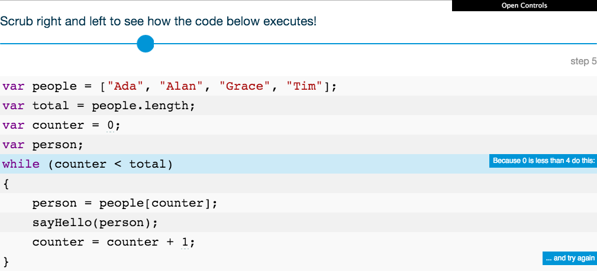
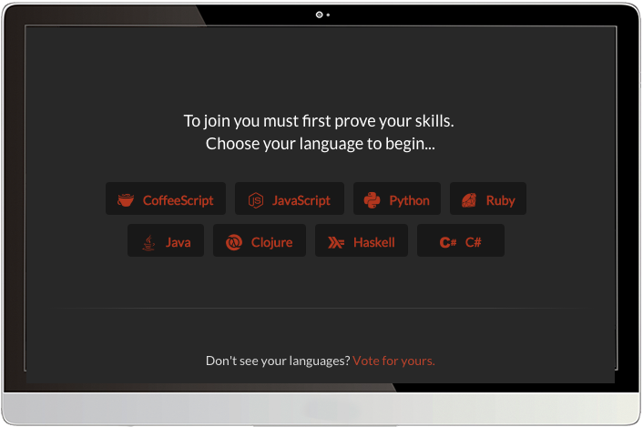

# Week 2

### Today, Thursday 8th October 2015

1. [Peer learning](#peer-learning)
* Workshop: [Hash Tags](#workshop) (part 2)
* Sign up to [CodeWars](#codewars)!
* Tutorials on [*Filter Bubbles*](#team-project)
 
### Your [homework](#homework) and [blog](#blog)!


# Peer learning

### What is peer learning?

It's a form of **cooperative** learning, that is: learning from *each other, together*.

In peer learning, everybody plays both the **teacher** and the **learner**.

<!-- > Docendo discimus [By teaching, we learn] -->

<!-- teaching forces you to dig deep and truly learn -->

By teaching to your peers, you reinforce your own learning. [It works](http://visible-learning.org/hattie-ranking-influences-effect-sizes-learning-achievement/hattie-ranking-teaching-effects)!

Also, you get to practice and build confidence in your **communication skills**.

At the end of your mini-lectures we'll give each other **feedback**. *Honest* feedback can hurt but it's through that (and practice) that we improve.

<!--
**Intellectual scaffolding** should be provided by the teacher. Simply placing students in groups and telling them to *work together* is not going to automatically yield results. The teacher must consciously *orchestrate* the learning exercise and choose the *appropriate vehicle* for it. For instance:

* picking subjects for teams, raising questions/issues that prompt students towards more sophisticated levels of thinking
*  structuring the tasks that learners are going to perform, both independently and in class
* watching for and correcting mistakes 
* providing positive feedback and encouragement

**Affinity Groups**: groups of 4–5 students are each assigned particular tasks to work on outside of formal contact time. At the next formal meeting with the teacher, the sub-group, or a group representative, presents the sub-group’s findings to the whole tutorial group.

**Positive interdependence** emphasises the importance and uniqueness of each group member’s efforts while important cognitive activities and interpersonal dynamics are quietly at work. As students communicate with one another, they inevitably assume leadership roles, acquire conflict-managing skills, discuss and clarify concepts, and unravel the complexities of human relationships within a given context; this process enhances their learning outcomes.

Beware of *freeloaders*.
-->

### Let the peer learning begin

#### 6 teams

~3 people per team 

#### 15 minutes per team

* ~10 for mini-lecture 
* ~5 for questions and debate

#### Mini-lectures topics

1. [Objects of intense feeling: the case of the Twitter API](http://computationalculture.net/article/objects-of-intense-feeling-the-case-of-the-twitter-api)
* The [Critical Engineering Manifesto](http://criticalengineering.org/)
* [Below the API](http://www.forbes.com/sites/anthonykosner/2015/02/04/google-cabs-and-uber-bots-will-challenge-jobs-below-the-api/)
* Computational thinking
* Functions and functional programming
* `for` loops 

<!--
Your team **presentation** (bear in mind, *presentation* does not mean PowerPoint slides.. be creative) should be **~20 minutes** and you may include:

* Summary of main ideas
* Links, images or videos of projects / products / things referenced in your research
* Other relevant things you've read, heard or seen
* Examples and demonstrations
* Personal experiences

Each team should also prepare **1-2 questions for the class**. After your presentation, we will have a short group discussion around these questions.
-->

### Let's give each other *honest* **feedback**

#### Presentation **content**   
	
1. How did you **plan** your presentation?
* What were the **key points** you wanted to get across?
* How did you decide to communicate them?
* What **assumptions** have you made about what we already know?
* How **interactive** was your presentation? How was the audience meant to *participate*? 
* What **questions** have you planned to ask your audience? How *open* were those questions? What type of questions (*Right-there*, *Between-the-lines* or *Opinion-needed* questions)?
	
#### **Delivery**
	
1. What role did **visuals** (eg: slides) play in your presentation?
* What role did each **team member** play in delivering the presentation? 
* How did you **practice** your presentation?
* How did your presentation start? How did you *hook* your audience?
* What was your **body language** like? Consider facial expressions, movements of the arms, eye contact with the audience, and posture.
* What was your **voice** like? Consider speed of delivery, pausing, volume and pitch

<!--
* Did you keep within the time?   
-->
	
#### What can be **improved**?

<!--
* Where are you publishing your research and presentation?  
-->


# Workshop

### Hash Tags (part 2)

All the code for this workshop is [here](../../resources/instagram).

#### Pull data from Instagram for **2 opposite hashtags** and build an expressive display

1. Part 1 is [here](../01#workshop).
* Traversing data: **loops**. 
	
	[ **WHILE** loop interactive demo](http://codepen.io/baddeo/full/NGjJjd/)
	
	[ **FOR** loop interactive demo](http://codepen.io/baddeo/full/YyVdVN/)
	
	You may want to try this [Codecademy's JS loops tutorial](https://www.codecademy.com/courses/javascript-beginner-en-NhsaT/0/1)
	
* Build a simple grid of pictures. Remember CSS?
* Play with *size*, *position*, *transparency*...

If you want to try a shortcut, here's [Instafeed](http://instafeedjs.com/). 


# Codewars

> Improve your skills by training with others on real code challenges

<!--

http://thoughts.baddeo.com/codewars

It gamifies the experience of learning to code in a rather addictive way: 

* a playful environment when solving coding puzzles/challenges (it feels like a game, although it could do with a bit of sound says Aimee)
* get points and level up as you progress
* compare and discuss your solution with those of other members of the community: it’s fascinating to see how other people approach and solve the same challenge and an invaluable learning opportunity

-->

[](http://www.codewars.com/r/DQC6uA)

1. Before you can sign up you'll have to complete a couple of challenges.
* Click the `JavaScript` button. 
* First challenge
	```js
	function multiply(a, b){
  		a * b
	}
	```
* Second challenge
	```js
	function Person(name){
	  this.name = name;
	}
	
	Person.prototype.greet = function(otherName){
	  return "Hi " + otherName + ", my name is " + name;
	}
	```
* You can now sign up!	

	* Link your GitHub account
	* In the `Clan` field enter **RaveWebMedia**. This way we'll be part of the same team and we'll be able to challenge each other


# Team project

### Filter Bubbles tutorials

This **team project** is about pushing yourself out of your online comfort zone (aka *filter bubble*) to observe different communities and express your points of view through code.

All the project material is [here](../../projects/filter-bubbles).

### 6 teams

### 10 minutes per team

1. What do you think about [Eli Pariser's TED talk](http://www.ted.com/talks/eli_pariser_beware_online_filter_bubbles?language=en#t-53082)?
* What *communities* and/or *hashtags* have you been **researching**?
* Let's see your **ideas** (inspired by?) for visualisations and **code experiments**. 
* What's your team **GitHub repository**? 
	* You may want to [create an *organisation*](https://github.com/organizations/new) (a GitHub group) for that.. 


# Homework

### Codewars katas

Complete at least 2 challenges (aka *katas*) on the beginner level (aka *8 kyu*).

### Peer learning

1. **Publish** your presentation and any other relevant material. We recommend GitHub (we :green_heart: :octocat:) but you can publish elsewhere as long as it's accessible by anyone.

2. Add the link to your presentation (and any other relevant material) to the `Teams` Google document I emailed you.

### Project 

Work on *Filter Bubbles* **with your team**:

* Pick one idea to finalise.
* Continue coding: push your experiments to the team GitHub repo.
* Document your research on your team GitHub repo wiki

### Blog 

Pair up with another team and **give each other feedback** on your peer learning mini-lectures. 

Use the questions above to give / get feedback on your [presentations' content](#presentation-content) and [delivery](#delivery).

Then write down a *summary* of the feedback you received and a *list of action points* in response to the question: 

> What can be **improved**?

<!--
**Individually**, write about *Filter Bubbles*. 

Reflect on how the idea is evolving and document **your** thought process. 

Also, write about your coding experiments.
-->