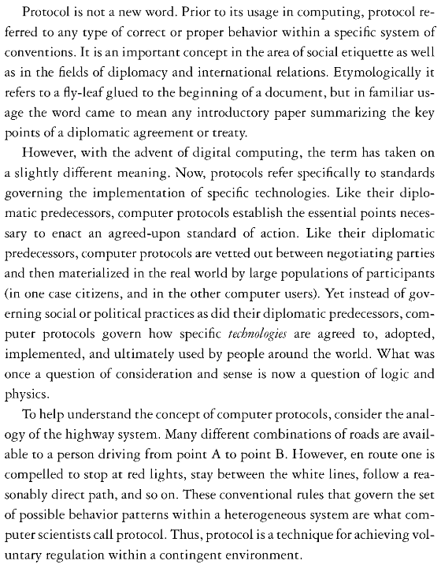

# APIs

### What are **protocols**?

<!--- [ ] Talk about **protocols** (ties in with rules of the road above, btw)?-->

* Rules
* Conventions, system of
* Proper / improper behaviour
* Social protocols
* Technical protocols (HTTP, TCP/IP, DNS)
* Centralised vs decentralised: power and control
* APIs as protocols..

[](https://mitpress.mit.edu/books/protocol)

<!-- https://github.com/lmccart/itp-critical-apis/blob/master/discussion/08%20Galloway%20Protocol-OCR.pdf -->


### So what's an **API** then? 

[Disambiguation](https://en.wikipedia.org/wiki/API_(disambiguation)) from Wikipedia.

**A**pplication **P**rogramming **I**nterface.

Something to do with programming applications... an interface for programming applications?! 

### What is an **interface**?

Something that stands **between** you and your goals. 

We're mostly familiar with *graphical user interfaces*, aka *GUI*, such as the icon buttons you click to launch an app, send an email or even start the washing machine.


Gas cookers have interfaces too: you don't operate the flame directly. The interface you use, the thing between you and the flame, are the *knobs* you push and turn.

### An interface to program applications?

> In computer programming, an application programming interface (API) is a set of routines, **protocols**, and tools for building software applications. An API expresses a software component in terms of its operations, *inputs*, *outputs*, and underlying types. [...] A good API makes it easier to develop a program by providing all the building blocks. A programmer then puts the blocks together.

> From [Wikipedia](https://en.wikipedia.org/wiki/Application_programming_interface)

An API **exposes** parts of a system and **determines** how we (programmers) can interact with them to accomplish our (programming) goals. 

Not all parts of a system are exposed, ie *programmable*. 

### The parts of a system which are *programmable* have an API 

An API tells us *which* parts of a system are exposed, and *how* we are allowed to tinker with them. 

A **programming language** can be understood as an API, in the sense that it's the tool between us and programming a computer. 

### JavaScript is our API to a Web browser 

If you want to display the square root of a number on a Web page, the browser can do the calculation for you, provided you ask nicely (ie, it allows you access to its computing functions, using the `Math` API, and more specifically the `Math.sqrt` function to do square roots operations). If you wanted to make the browser blow up your computer, there's no API for that. 

### Natural languages as APIs

We can think of natural languages (English, Chinese, etc.) as APIs. 

For example, if we need directions from the Tour Eiffel to the Louvre, we can use the *French people's API* to ask for that information. 

Using its **dictionary**, we can get the building blocks of our request, which we piece together following the instructions of a decent grammar book. 

> Excusez-moi, comment puis-je marcher d'ici au Louvre?

See the [(Google) translation](https://translate.google.com/#fr/en/Excusez-moi%2C%20comment%20puis-je%20marcher%20d'ici%20au%20Louvre%3F) for the sentence above.


The *French API* gives us several ways of expressing the same request (or **input**).

However, it doesn't tell us much about the response (or **output**). In fact, it doesn't even guarantee that we're going to get a response at all.

The French API is not as **predictable** as a Web browser's API.

Experience tells us that we would likely get a satisfying response to our question above, however we won't get a friendly response if we were to ask a stranger for personal information, even though the *French API* has no explicit ban for that.

> Excusez-moi, combien de fois avez-vous fait caca ce mois-ci?

See the [(Google) translation](https://translate.google.com/#fr/en/Excusez-moi%2C%20combien%20de%20fois%20avez-vous%20fait%20caca%20ce%20mois-ci%3F) for the sentence above.


<!-- An API defines functionalities that are independent of their respective implementations, which allows definitions and implementations to vary without compromising the interface.

an API specifies a set of functions or routines that accomplish a specific task or are allowed to interact with a specific software component.-->

### API key concepts

* **Dictionary** for *vocabulary*

* **Rule book** for *grammar* (protocols)

* **Instruction manual**, aka `documentation`, `docs` or `reference`. Without it an API is unusable

<!--### An instruction manual?

> An API is essentially an *instruction manual* for a piece of software.

> From [The universe is programmable](http://www.wired.com/2014/04/the-universe-is-programmable/)

Well, the instruction manual is an important but not fundamental part of an API, just like the manual for an electric device can help you make the most of your new toy, but it's not *the thing*.

A good API comes with a thorough **documentation** (the instructions manual, also known as `docs` or `reference`), which explains what you have to send the code (input) and what it will spit back out (output). 

Without it, an API is unusable.-->

<!--### A rule book?

An API has both a *dictionary* and a *rule book*: which actions you're allowed (and not allowed) to perform and how, which information you're allowed to ask and how often..-->

<!--A **dictionary** is part of a natural language's API. But a language is more than a dictionary of words.-->

<!--
### Digital glue? 

> Think of an API as *digital glue* in the digital value chain, powering mobile and web apps, connecting disparate systems, and enabling innovation.

> From [APIs for dummies](http://media.wiley.com/assets/7255/37/9781118937228_custom.pdf), an introduction to APIs for business leaders crafted by APIGee, a company that builds and sells APIs.
-->

### A(nother) metaphor

> In the Book of Genesis, God is the ultimate *programmer*, creating all of existence in a monster six-day *hackathon*.

<!-- 
link to generative art, see https://www.futurelearn.com/courses/creative-coding-2/steps/35833

* the specification of the process is far simpler than the outcomes generated
* patterns, forms and behaviours are not explicitly programmed by the artist
* some behaviour cannot be predicted in advance

-->

> The API [...] is really one of the most profound metaphors of our time.

> From [The universe is programmable](http://www.wired.com/2014/04/the-universe-is-programmable/)

Reductionism. Can we reduce *everything* to an input-output machine? As we've seen with the *French API*, not all systems are deterministic (given an input we can determine the output).

Yet once you try framing "everything" around you as a set of APIs, you can start to understand the mindset of people in the *makers*, *open-source* or *hackers* communities: how they can see things around them as a **set of programmable tasks**, or usable sets of **data** and tools.

### A buzzword

Just like many other **fuzzy ideas** (eg: money) there isn't a single definition, but rather many manifestations of the thing we call API.

Rather than ruminating over what APIs are, we can look at the benefit(s) of using them, or **why** it makes sense to frame our interactions with hardware, software, databases and services offered by other institutions (the Google APIs, the Facebook APIs etc) in terms of *application programming interfaces*.

### **Abstraction** and **separation of concerns**

Using APIs, we don't have to write our programs in 0s and 1s.

We don't have to worry about how the API gets the job done, as long as it *returns* what we asked for.

> Being able to write **what** we want to do instead of **how** we do it means we are working at a higher level of abstraction. In practice, this means shorter, clearer, and more pleasant code.

From [Eloquent JavaScript: functional programming](http://eloquentjavascript.net/1st_edition/chapter6.html#p75cea5d2d73e38c4)

<!-- ...software talking to other software (http://blog.garrytan.com/the-api-ization-of-everything)-->

### APIs technical concepts

<!--
We add `q=your+search+terms` to the URL and Google will return results for those terms
	
[https://gender-api.com/**get?name=matteo**](https://gender-api.com/get?name=matteo)
-->


* **URLs** for data
	
	[https://www.google.co.uk/search?**q=banana**](https://www.google.co.uk/search?q=banana)
	
	* The first part of the URL is called **endpoint** 
		
		`https://www.google.co.uk/search?`
	
	* You send your request(s) to an endpoint and specify which data you want via **parameters**
	
		`q=banana`	
	
* API **key**(s), like a library card that you use to identify yourself when borrowing books

	Sometimes referred to as `client id`, `consumer key`, `access token` and other fancy words

	[https://api.instagram.com/v1/tags/search?**q=snowy**&**client_id=YOUR_CLIENT_ID**](https://instagram.com/developer/endpoints/tags/#get_tags_search)
	
	**HEADS UP!** The last parameter in the URL above according to the official Instagram API manual is `access_token` but you can use your CLIENT ID instead and skip having to generate an access token every time! 


<!--	https://instagram.com/developer/-->


# Week 2

### Today, Thursday 8th October 2015

1. [Peer learning](#peer-learning)
* Workshop: [Hash Tags](#workshop) (part 2)
* Sign up to [CodeWars](#codewars)!
 
### Your [homework](#homework) and [blog](#blog)!


# Peer learning

### What is peer learning?

It's a form of **cooperative** learning, that is: learning from *each other, together*.

In peer learning, everybody plays both the **teacher** and the **learner**.

<!-- > Docendo discimus [By teaching, we learn] -->

<!-- teaching forces you to dig deep and truly learn -->

By teaching to your peers, you reinforce your own learning. [It works](http://visible-learning.org/hattie-ranking-influences-effect-sizes-learning-achievement/hattie-ranking-teaching-effects)!

Also, you get to practice and build confidence in your **communication skills**.

At the end of your mini-lessons we'll give each other **feedback**. *Honest* feedback can hurt but it's through that (and practice) that we improve.

<!--
**Intellectual scaffolding** should be provided by the teacher. Simply placing students in groups and telling them to *work together* is not going to automatically yield results. The teacher must consciously *orchestrate* the learning exercise and choose the *appropriate vehicle* for it. For instance:

* picking subjects for teams, raising questions/issues that prompt students towards more sophisticated levels of thinking
*  structuring the tasks that learners are going to perform, both independently and in class
* watching for and correcting mistakes 
* providing positive feedback and encouragement

**Affinity Groups**: groups of 4–5 students are each assigned particular tasks to work on outside of formal contact time. At the next formal meeting with the teacher, the sub-group, or a group representative, presents the sub-group’s findings to the whole tutorial group.

**Positive interdependence** emphasises the importance and uniqueness of each group member’s efforts while important cognitive activities and interpersonal dynamics are quietly at work. As students communicate with one another, they inevitably assume leadership roles, acquire conflict-managing skills, discuss and clarify concepts, and unravel the complexities of human relationships within a given context; this process enhances their learning outcomes.

Beware of *freeloaders*.
-->

### Let the peer learning begin

#### 6 teams

~3 people per team 

#### 15 minutes per team

* ~10 for mini-lesson 
* ~5 for questions and debate

#### Mini-lessons topics

1. [Objects of intense feeling: the case of the Twitter API](http://computationalculture.net/article/objects-of-intense-feeling-the-case-of-the-twitter-api)
* The [Critical Engineering Manifesto](http://criticalengineering.org/)
* [Below the API](http://www.forbes.com/sites/anthonykosner/2015/02/04/google-cabs-and-uber-bots-will-challenge-jobs-below-the-api/)
* Computational thinking
* Functions and functional programming
* `for` loops 

### Let's give each other *honest* **feedback**

#### Mini-lesson **content**   
	
1. How did you **plan** your mini-lesson?
* What were the **key points** you wanted to get across?
* How did you decide to communicate them?
* What **assumptions** have you made about what we already know?
* How **interactive** was your mini-lesson? How was the audience meant to *participate*? 
* What **questions** have you planned to ask your audience? How *open* were those questions? What type of questions (*Right-there*, *Between-the-lines* or *Opinion-needed* questions)?
	
#### **Delivery**
	
1. What role did **visuals** (eg: slides) play in your mini-lesson?
* What role did each **team member** play in delivering the mini-lesson? 
* How did you **practice** your mini-lesson?
* How did your mini-lesson start? How did you *hook* your audience?
* What was your **body language** like? Consider facial expressions, movements of the arms, eye contact with the audience, and posture.
* What was your **voice** like? Consider speed of delivery, pausing, volume and pitch

<!--
* Did you keep within the time?   
-->
	
#### What can be **improved**?

<!--
* Where are you publishing your research and mini-lesson?  
-->


# Workshop

### Hash Tags (part 2)

All the code for this workshop is [here](../../resources/instagram).

#### Pull data from Instagram for **2 opposite hashtags** and build an expressive display

1. Part 1 is [here](../01#workshop).
* Traversing data: **loops**. 
	
	[ **WHILE** loop interactive demo](http://codepen.io/baddeo/full/NGjJjd/)
	
	[ **FOR** loop interactive demo](http://codepen.io/baddeo/full/YyVdVN/)
	
	You may want to try this [Codecademy's JS loops tutorial](https://www.codecademy.com/courses/javascript-beginner-en-NhsaT/0/1)
	
* Build a simple grid of pictures. Remember CSS?
* Play with *size*, *position*, *transparency*...

If you want to try a shortcut, here's [Instafeed](http://instafeedjs.com/). 


# Codewars

> Improve your skills by training with others on real code challenges

<!--

http://thoughts.baddeo.com/codewars

It gamifies the experience of learning to code in a rather addictive way: 

* a playful environment when solving coding puzzles/challenges (it feels like a game, although it could do with a bit of sound says Aimee)
* get points and level up as you progress
* compare and discuss your solution with those of other members of the community: it’s fascinating to see how other people approach and solve the same challenge and an invaluable learning opportunity

-->

[](http://www.codewars.com/r/DQC6uA)

1. Before you can sign up you'll have to complete a couple of challenges.
* Click the `JavaScript` button. 
* First challenge
	```js
	function multiply(a, b){
  		a * b
	}
	```
	
	Hint: add a `return` somewhere..
* Second challenge
	```js
	function Person(name){
	  this.name = name;
	}
	
	Person.prototype.greet = function(otherName){
	  return "Hi " + otherName + ", my name is " + name;
	}
	```
	
	Hint: add a `this.` somewhere..
* You can now sign up!	

	* Link your GitHub account
	* In the `Clan` field enter **RaveWebMedia**. This way we'll be part of the same team and we'll be able to challenge each other.


# Homework

### Codewars katas

Complete at least 2 challenges (aka *katas*) on the beginner level (aka *8 kyu*).

### Peer learning

1. **Publish** your mini-lesson and any other relevant material. We recommend GitHub (we :green_heart: :octocat:) but you can publish elsewhere as long as it's accessible by anyone.

2. Add the link to your mini-lesson (and any other relevant material) to the Google document I emailed you.

### Project 

Work on *Filter Bubbles* **with your team**:

* Pick one idea to finalise.
* Continue coding: push your experiments to the team GitHub repo.
* Document your research on your team GitHub repo wiki

### Blog 

Pair up with another team and **give each other feedback** on your peer learning mini-lessons. 

Use the questions above to give / get feedback on your [mini-lessons' content](#mini-lesson-content) and [delivery](#delivery).

Then write down a *summary* of the feedback you received and a *list of action points* in response to the question: 

> What can be **improved**?