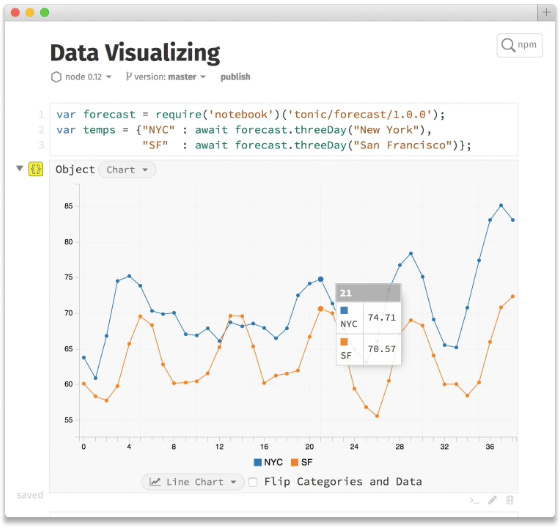

# Week 7

### Today, Thursday 12th November 2015

1. [Workshop](#workshop): using *Node.js* to conquer the World(ish)!
* Tutorials on [*Filter Bubbles*](#team-project)

### Your [homework](#homework)

# Workshop

[Node.js](https://nodejs.org) is an open-source, cross-platform *runtime* environment for developing **server-side** applications.

### Erm, **what** is a server?

Just a computer that is **always on**, **connected** to the Internet and ready to accept **HTTP requests** and serve documents (HTML, CSS, JS, JSON, images etc) in **response**.

Back-end 								| 	Front-end
---------------------------	| ---------
Server-side 							| 	Client-side
Server 									| 	Browser
PHP Ruby Python **Node.js**.. | JavaScript

### **Why** do we need a server again?

1. **Storage**, ie *hosting* stuff: websites, apps, media files...
* **Power**: a server computer can be a lot more powerful than the typical user computer, for example a mobile device
* **Dynamic content**: connect with a **database** to create pages on demand
* **Security**: you don't want private data (eg passwords) accessibly via *View Page Source* but locked away securely

### [NodeSchool](http://nodeschool.io/)

> Open source workshops that teach web software skills. Do them on your own or at a workshop nearby.

The DIY part of NodeSchool is really cool, as you can do [interactive tutorials](http://nodeschool.io/#workshoppers).

You will need: 

1. [Node.js installed](https://nodejs.org/en/download/) on your computer to get started. 
* Open **Terminal** (**CommandPrompt** on Windows), then use `npm` (it comes with Node) to install each tutorial with the *command* below it. 
	
	For example: `sudo npm install -g learnyounode` to install the basic Node.js interactive tutorial.
*	Once installed, simply type the tutorial's name to launch.

	For example: `learnyounode` to launch the basic Node.js interactive tutorial.

### Let's play

Go to [tonicdev.com](https://tonicdev.com) and sign up!

Tonic is a free, online *playground* that helps you learn Node.js and visualise your data.

# Team project

### Filter Bubbles tutorials

This **team project** is about pushing yourself out of your online comfort zone (aka *filter bubble*) to observe different communities and express your points of view through code.

All the project material is [here](../../projects/filter-bubbles).

### 6 teams

### 20 minutes per team

<!-- TODO -->

# Homework

### Codewars katas

Complete at least 2 challenges (aka *katas*) on the beginner levels (aka *8 kyu* or *7 kyu*).

### Peer learning

1. MonoVacation and other interesting `#dataviz` projects..

	
* D3.js and Raw
* IFTT and Zapier
* [Kimono](http://) and [Import.IO](https://import.io/)
* The Guardian API (and the Sun API?) in conjunction with MonkeyLearn?
* [Zooming into an Instagram city](http://firstmonday.org/ojs/index.php/fm/article/view/4711/3698)
* http://data.london.gov.uk
* https://words.bighugelabs.com/api.php
* https://www.reddit.com/r/SubredditSimulator/comments/3g9ioz/what_is_rsubredditsimulator/
