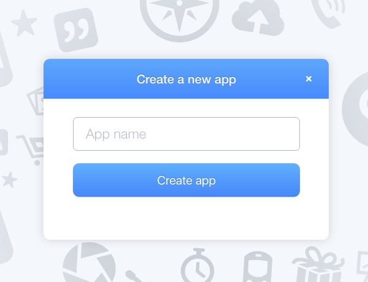
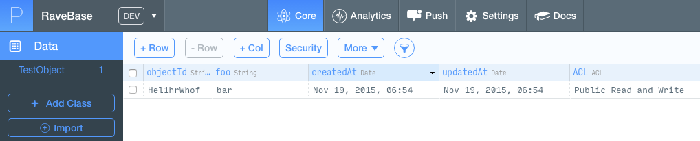

# Week 8

### Today, Thursday 19th November 2015

1. [Workshop](#workshop): using cloud databases
* [What have tomatoes got to do with productivity?](#what-have-tomatoes-got-to-do-with-productivity)
* Tutorials on [*Filter Bubbles*](#team-project)

<!--- [ ] Announcement: Rik in da house -->

### Your [homework](#homework)


# Workshop

### Why a *database* in the *cloud*?

Writing **server-side** code can be hard. 

Maintaining a server-side infrastructure can be even harder.

A standard scenario:

* You would create a MySQL database.
* You may have a PHP class that is responsible for performing CRUD operations. Optionally, you could just have a bunch of PHP functions.
* You may use JavaScript and Ajax on the client-side to call the respective PHP scripts and pass in query strings.
* You would need to sanitise the input to protect against XSS attacks, as well as worry about database security in general.
* If a collaborative app, you would need to track different users and manage their lists. More code, more tables, and more schemas.
* You would need to make sure your database stays performant.

Parse is a *database-as-a-service* platform, owned by Facebook.

Instead of building an maintaining your own server-side stack, you can use Parse.

> Focus on creating a beautiful end-user experience and let Parse take care of the rest.

Parse is not the only cloud database service. [Firebase](https://www.firebase.com) (owned by Google) is another one. [Amazon Web Services](https://aws.amazon.com/) offer various db solutions. Learn more about cloud databases [here](https://en.wikipedia.org/wiki/Cloud_database).

### All together now

1. Go to [parse.com](https://parse.com) and sign up for a free account. 
* The signup process will guide you through the creation of an *app*.

	

* Go to [Parse's quick-start page](https://parse.com/apps/quickstart) and choose `Data` > `Web` > `New project`. This will download a folder.
* Open the downloaded folder in a code editor.
* Notice the two scripts in the `head` of `index.html`

	```html
	<script type="text/javascript" src="http://ajax.googleapis.com/ajax/libs/jquery/1.7.2/jquery.min.js"></script>
  <script type="text/javascript" src="http://www.parsecdn.com/js/parse-latest.js"></script>
  ```
  
  jQuery and the Parse JavaScript SDK (**S**oftware **D**evelopment **K**it).
* Just before the end of the `body`, there's a `script` in which Parse is initialised.

	```js
	Parse.initialize("APPLICATION_ID", "JAVASCRIPT_KEY")
	```
	
	Change `APPLICATION_ID` to your app's id and `JAVASCRIPT_KEY` to your app's JS key. You can find those in your app > `Settings` > `Keys`
	
	
* Test the app in your browser.	
* Go to your Parse app and click on `Core`.

	If you didn't get an error in the previous step, you should see there's a new row in the `TestObject` table, something like this
	
	
	
	What happened?
	
	Back to the code editor, notice how the `TestObject` *class* was created
	
	```js
	var TestObject = Parse.Object.extend("TestObject")
	```
	
	Then a new *instance* of that class was made
	
	```js
	var testObject = new TestObject()
	```
	
	And finally the *data object* `{foo: "bar"}` was saved
	
	```js
	testObject.save({foo: "bar"}, 
	{
		...
	})
	```	

	With two function to handle the `success` and `error` scenarios.
  
This is Parse in a nutshell. Now go to their [JavaScript Guide](https://parse.com/docs/js/guide#getting-started) and see what other things you can do with Parse.  

* In particular, [Objects](https://parse.com/docs/js/guide#objects) are rather fundamental, as well as [Queries](https://parse.com/docs/js/guide#queries).

* If your app is **location-based**, you should check out [GeoPoints](https://parse.com/docs/js/guide#geopoints).

* If you want to build a **user-base**, then [Users](https://parse.com/docs/js/guide#users) may be very useful to you.

* If you want to let your users upload **files**, then [Files](https://parse.com/docs/js/guide#files) are what you need.

**CONFUSED?** Try [this Codecademy Parse tutorial](https://www.codecademy.com/en/tracks/parse).

### What could **you** build with Parse?

Let's brainstorm a few ideas. These can be based on your *Filter Bubbles* projects, completely unrelated to them, or anything in between.

# What have *tomatoes* got to do with *productivity*?

Behavioural economists have talked at length about *ego-depletion*, which means that human beings have a limited amount of decision-making ability in each day. 

>  The main thing is to keep the main thing the main thing.

> Steven Covey

To be productive, you want to focus on the **main task of the day** first, before you start getting distracted with {insert your distraction of choice here, including emails}.

### How to decide on the **main** thing?

> If this were the only thing I accomplished today, would I be satisfied with my day?

Write down the **3-5 things, and no more** that are making you most anxious or uncomfortable. 

<!--  most important = usually most uncomfortable/most procrastinated upon -->

###  The way you write down your task can dictate whether it will get done.

Is this **concrete**? 

Is it clearly **actionable**? 

Is there any *ambiguity* about how to **get started**?

### Back to tomatoes..

The *Pomodoro* (Italian for tomato) Technique® gets its name from a tomato-shaped timer that its founder, Francesco Cirillo, first used to combat his procrastination.

1. Decide on a clear task that you want to focus on that will take you at least **25 minutes** to do. 
* Start a timer for 25 minutes and start working on the task. This time block is known as a *Pomodoro*. It is an indivisible unit of time. You can never do half
a *Pomodoro*. Do not work on anything else. If you get distracted, gently bring yourself back to work.
It happens. Relax. If your distraction pulls you away from the task at hand, cancel the *Pomodoro* by resetting the timer to zero. 
* Once the timer ends, time for a mini-celebration! Get up, stretch, get some more water, do a happy dance. You have **5 minutes of break** time until you start the next *Pomodoro*.

Read all about it in the [Productivity Planner](https://drive.google.com/open?id=0B0FP625GojKHRlJRZWQ4cjVvSFk)


# Team project


### Filter Bubbles tutorials

This **team project** is about pushing yourself out of your online comfort zone (aka *filter bubble*) to observe different communities and express your points of view through code.

All the project material is [here](../../projects/filter-bubbles).

### 6 teams

### 20 minutes per team


# Homework

- [ ] Work and blog on Filter bubbles
- [ ] Show and tell for next week